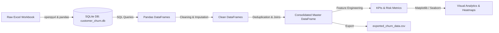

# Churn Analysis & Customer Intelligence

An end-to-end customer analytics and business intelligence project exploring subscription churn dynamics, customer lifetime value (CLTV), customer service friction, and revenue exposure. The pipeline extracts multi-relational transactional data into an embedded relational SQLite database, performs robust data cleaning, feature engineering, exploratory data analysis (EDA), and builds diagnostic visualizations.

---

## 📌 Project Overview

Customer attrition directly impacts recurring business revenue. This project models customer journeys across subscription profiles, customer demographics, and support interactions to identify attrition patterns and high-risk customer segments.

### Key Objectives
- **Data Engineering & ETL:** Ingest multi-sheet raw Excel workbook data into an embedded SQLite database (`customer_churn.db`), query structured tables, and join relational data.
- **Data Cleansing & Wrangling:** Standardize categorical classifications, impute geographic features through deterministic mapping, and resolve support escalation event duplication.
- **Feature Engineering:** Derive target flags (`churn_flag`), customer tenure duration (`tenure_days`), risk categories (`churn_risk`), and aggregated complaint frequency.
- **Exploratory Data Analysis:** Calculate SaaS/Subscription operational KPIs (Churn Rate, Retention Rate, ARPU, Revenue at Risk, Escalation Rate).
- **Behavioral Diagnostics:** Measure correlation between unresolved escalation events and churn outcomes using heatmaps, time-series monthly trendlines, and multi-dimensional categorical distributions.

---

## 📊 Key Business Metrics & Findings

| Metric | Result | Interpretation |
| :--- | :--- | :--- |
| **Churn Rate** | **28.57%** | Base attrition rate across the customer dataset |
| **Retention Rate** | **71.43%** | Active retained subscription ratio |
| **Average Revenue Per User (ARPU)** | **$18.85** | Mean monthly subscription billing rate across all tiers |
| **Revenue at Risk** | **$73.94K** | Total recurring monthly revenue directly lost to cancellations |
| **Escalation Rate** | **19.05%** | Percentage of users with ticket escalations |
| **Escalation-to-Churn Correlation** | **0.77** | Strong linear correlation indicating support friction strongly drives cancellations |

### Primary Segment Insights
- **Churn by Plan Tier:**
  - **Basic Plan:** Highest churn rate at **60.00%**
  - **Standard Plan:** **22.22%** churn rate
  - **Premium Plan:** Lowest churn rate at **14.29%**
- **Average Customer Tenure:** Users average **1,550 days** active prior to churn or current standing.
- **Support Frequency Impact:** Customers with multiple escalations or CSAT ratings below 30 show the highest likelihood of immediate cancellation.

---

## 🛠️ Tech Stack & Libraries

- **Language:** Python 3.10+
- **Data Ingestion & SQL:** `sqlite3`, `openpyxl`
- **Data Manipulation:** `pandas`, `numpy`
- **Visualization:** `matplotlib`, `seaborn`
- **Notebook Environment:** Jupyter / IPython

---

## 📂 Repository Structure

```text
├── .gitignore                          # Ignored caches, DB files, and environments
├── README.md                           # Project documentation & summary
├── churn_analysis.ipynb                # Primary end-to-end analysis notebook
├── customer_churn_data_raw.xlsx        # Raw data (Customer, Subscription, Support sheets)
├── exported_churn_data.csv             # Cleaned, merged, and feature-engineered dataset
└── test_database.sqlite                # Local SQLite verification database
```

---

## 🔄 Data Pipeline Architecture



### 1. Ingestion & Database Loading
- Raw Excel workbook sheets (`db_customer`, `db_subscription`, `db_support`) are read and written directly into an SQLite database via `to_sql()`.
- Metadata inspection is performed using SQLite `PRAGMA table_info()` commands.

### 2. Cleaning & Standardization
- **Customer Entity:** Standardized values (`'Men'`/`'Women'` transformed to `'Male'`/`'Female'`), missing `country` values imputed using unique `state -> country` mappings, and empty utility columns removed.
- **Support Entity:** Multiple complaints per customer deduplicated by computing an aggregated `complaint_count` and retaining the most recent timestamp.
- **Datetime Casting:** Converted `dob`, `subscription_start_date`, `renewal_date`, `cancellation_date`, and `complaint_date` to `datetime64[ns]`.

### 3. Feature Engineering
- **`churn_flag`:** Binary classification indicating whether a subscription has been cancelled (`1` if `cancellation_date` is non-null, else `0`).
- **`tenure_days`:** Calculated active lifespan derived from cancellation timestamp or current execution date relative to `subscription_start_date`.
- **`churn_risk`:** Segmented risk levels categorized based on `churn_score` thresholds:
  - `low`: $< 50$
  - `med`: $50 - 69$
  - `high`: $\ge 70$

---

## 📈 Visualizations Included

- **Monthly Churn Trend:** Time-series tracking cancellation volume over monthly periods.
- **Plan Type & Regional Loss:** Bar chart evaluations of churn percentage partitioned by plan tier (`Basic`, `Standard`, `Premium`) and user location (`state`).
- **Feature Correlation Heatmap:** Encoded categorical variables and binary metrics to diagnose correlation coefficients across escalations, churn scores, plan tiers, and retention.
- **FacetGrid / Catplot Distributions:** Multi-dimensional visualization comparing monthly charges across gender, plan tiers, and churn risk tiers.

---

## 🚀 Setup & Execution

### 1. Clone the Repository
```bash
git clone https://github.com/Vijaykumarr2021/Churn_Analysis_and-Customer_Intelligence.git
cd Churn_Analysis_and-Customer_Intelligence
```

### 2. Set Up a Virtual Environment
```bash
python3 -m venv .venv
source .venv/bin/activate   # On Windows: .venv\Scripts\activate
```

### 3. Install Required Dependencies
```bash
pip install pandas numpy matplotlib seaborn openpyxl jupyter
```

### 4. Launch Jupyter Notebook
```bash
jupyter notebook churn_analysis.ipynb
```

---

## 👤 Author

- **Vijay Kumar**
- GitHub: [@Vijaykumarr2021](https://github.com/Vijaykumarr2021)